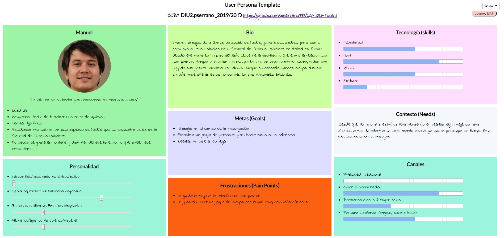
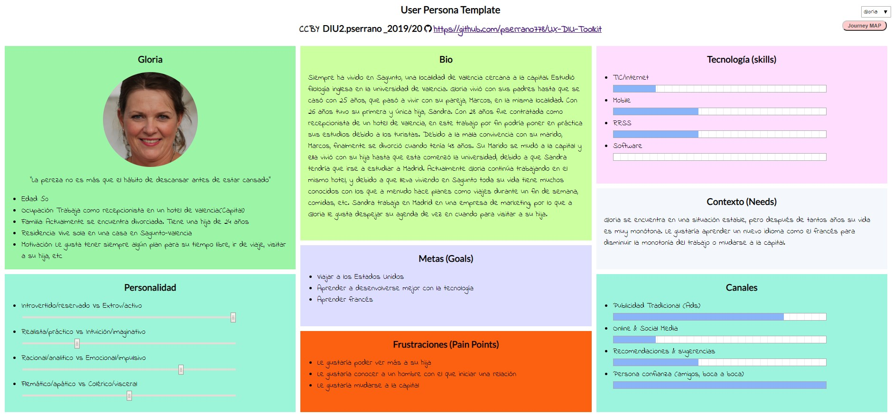
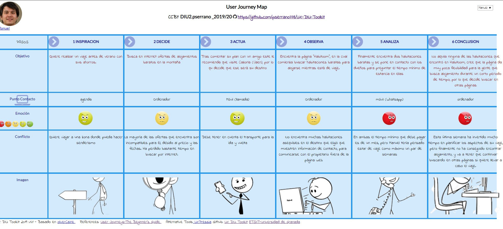
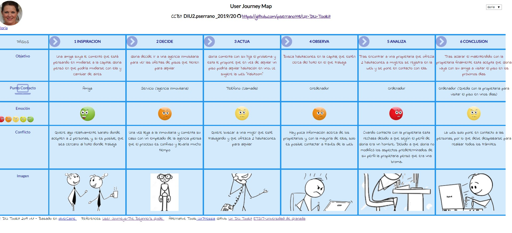

## DIU - Practica1, entregables

# Proceso de Diseño 

## Competitive Analysis

>>> Badi:

>>>> Permite publicar una habitación para buscar un inquilino y realizar una búsqueda para reservar y alquilar una habitación.
Posee un sistema de búsqueda que utiliza GoogleMaps para poder buscar una habitación en una ciudad concreta. Este sistema posee una herramienta para buscar alojamiento cerca de donde se encuentra el usuario actualmente usando la ubicación. No es necesario estar registrado para realizar una búsqueda.

>>> Couchsurfing:

>>>>Su principal objetivo es compartir una casa con viajeros y compartir experiencias en la ciudad del huésped, de forma que este actúa como guía para el viajero.
Cada usuario debe rellenar información sobre su estilo de vida y objetivos en su perfil. De esta forma es más fácil encontrar personas afines. 

>>> Compartetupiso:

>>>> Permite ofrecer y buscar alojamiento en función de la "experiencia" que el usuario quiere experimentar, es decir, en función de si desea compartir aficiones con alguien, trabajar en un campo relacionado (afinidad profesional), etc.
Los usuarios son verificados de forma manual y se comprueba que una persona puede realmente ofrecer un espacio. Los usuarios que ofrecen alojamiento pueden optar por cobrar o no un alquiler.
Cuando tratas de iniciar sesión, siempre aparece la misma pantalla con el mensaje “Gracias, ya tenemos tus datos, en breve te contactaremos.”

>>> Habitoom:

>>>> Es un sitio web cuyo objetivo es conectar personas que buscan un lugar para vivir con aquellas que ofrecen un sitio para alquilar.
Este sitio web trata de crear una comunidad para que todos aporten sus experiencias vividas de forma que sirvan como referencia a futuros inquilinos.
Permite realizar búsquedas de alquileres sin necesidad de registrarse, aplicando filtros en la búsqueda como metros cuadrados, número de inquilinos, edad de los inquilinos, etc.
Habitoom permite que el usuario no solo publique un espacio para alquilar o buscar uno, también permite crear alertas con ciertos filtros para que avisen al usuario cuando alguien ha publicado un alquiler que se adapte.
En el registro no se pide información como el sexo o la fecha de nacimiento del usuario, por lo que estos son asignados a un valor predefinido, por lo que el usuario ha de cambiarlos posteriormente. 
He escogido este sitio web debido a que posee un servicio premium que permite publicación ilimitada de espacios de alquiler, publicar todos los datos de contacto, etc.

## Persona

>>> Manuel

>>>> He escogido a Manuel debido a que acaba de finalizar sus estudios y quiere tomarse un tiempo libre antes de comenzar a trabajar. Hasta ahora sus padres pagaban los costes de sus estudios, alojamiento, etc, por ello se encuentra en una etapa crítica en la que debe volverse totalmente independiente en el aspecto económico y, por tanto, no tiene mucho tiempo hasta que tenga que adentrarse de lleno en el mundo laboral.

>>>Ficha Manuel:

>>> Gloria

>>>> Gloria, la otra persona que he elegido, se trata de una mujer divorciada de edad avanzada que lleva viviendo durante toda su vida en el mismo sitio y lleva trabajando durante muchos años como recepcionista en un hotel. Aunque tiene estabilidad tanto económicamente como en el ámbito personal su vida es muy monótona ya que lleva mucho tiempo viviendo en el mismo lugar y trabajando en el hotel.

>>>Ficha Gloria:

## User Journey Map

>>> La experiencia de Manuel es bastante común. Una persona joven quiere ir de viaje, pero no tiene mucho dinero, por lo que busca compartir un piso/alquilar una habitación para no tener que gastar mucho en alojamiento. El problema es que debido a las prisas no utiliza la web adecuada para esta búsqueda, por lo que no queda nada satisfecho.

>>>Experiencia Manuel:

>>> La experiencia de Gloria es menos habitual, teniendo en cuenta que se trata de una persona con 50 años. Lleva toda su vida viviendo en el mismo pueblo, pero decide mudarse a la capital, donde trabaja, con una amiga. En este caso si utiliza una web adecuada, el problema viene cuando se encuentra con las carencias de la web, que para una persona no acostumbrada a navegar por internet o al uso de ordenadores pueden hacerle pasar un mal rato.

>>>Experiencia Gloria:

## Usability Review

>>> Usability Review: [Usability-review-DIU2-pserrano](Usability-review-DIU2-pserrano.pdf)

>>> Valoración numérica: 67.

>>> El sitio web “Habitoom” tiene como finalidad poner en contacto a personas con el fin de alquilar una habitación. Trata de ser una especie de “red social” para alquiler de habitaciones.
Una de las principales desventajas es el periodo de estancia mínimo de 1 mes, que se debe a que está destinada a personas que se mudan por cuestiones de trabajo, estudios, etc. Esto hace que sea poco flexible e inviable para personas que buscan alojamiento para vacaciones o similares.

>>> En cuanto a la funcionalidad Habitoom cumple su objetivo. Proporciona las herramientas necesarias para poner un anuncio de una habitación o buscar una. A pesar de cumplir su objetivo posee carencias como la poca flexibilidad de su sistema de búsqueda, que solo permite buscar con el formato “Provincia, País”, lo cual es bastante incómodo para cualquier usuario. Otra de sus grandes desventajas es la poca información que se requiere para crearse una cuenta (e-mail, nombre y contraseña), el resto de campos de información o están predeterminados (sexo o fecha de nacimiento) o no es necesario completarlos (foto de perfil, descripción, etc), lo que hace que un usuario poco no modifique estos parámetros de su perfil.

>>> Por último, posee un servicio premium que permite publicar un número ilimitado de habitaciones y publicar el número de teléfono personal. Este aspecto es bastante negativo, ya que la mayoría de usuario no pagan dicho servicio, pero el número de teléfono es la mejor forma para comunicar a usuario normales (uso a aplicaciones de mensajería como “Whatsapp”) en casos como alquiler de piso o habitación. Esto provoca que el número de usuarios potenciales decrezca debido a las pobres formas que tiene el sitio web de poner en contacto a los usuarios.

>>> La conclusión es que, aunque ofrece las funcionalidades básicas para cumplir su objetivo, su filosofía de red social hace que sea una web inferior a muchas otras similares (en el ámbito de alquilar piso, compartir piso, etc).
