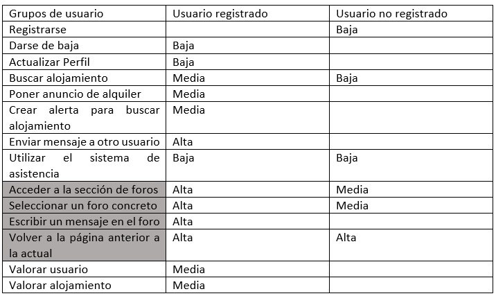
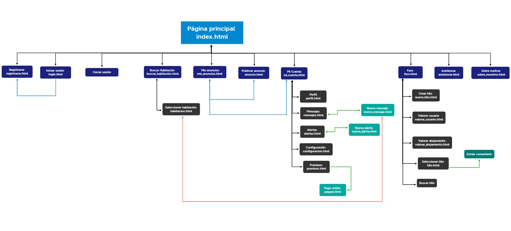
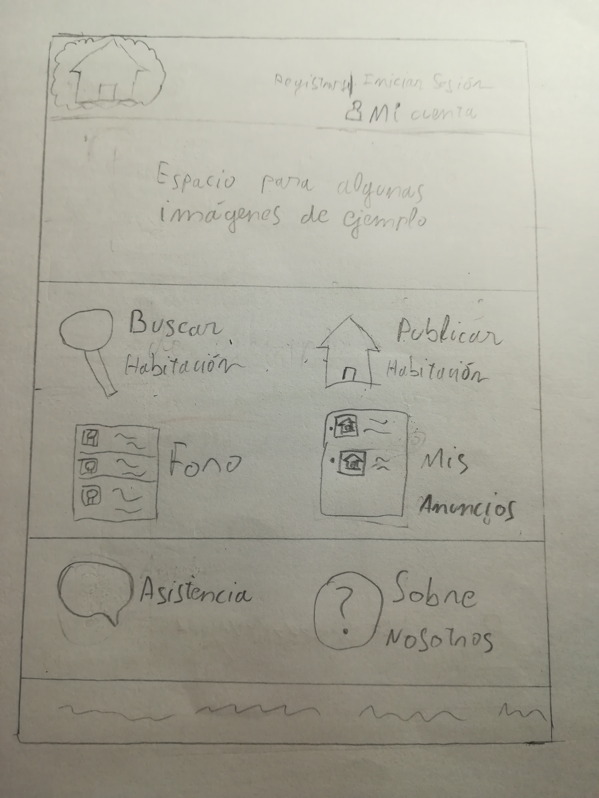
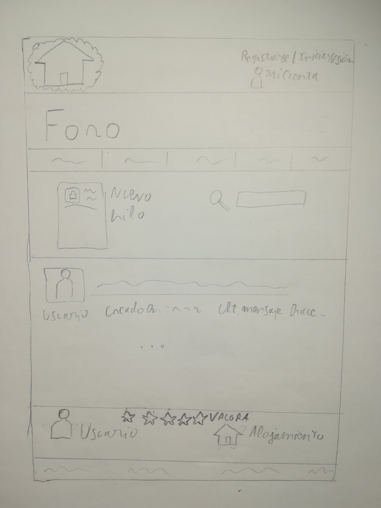
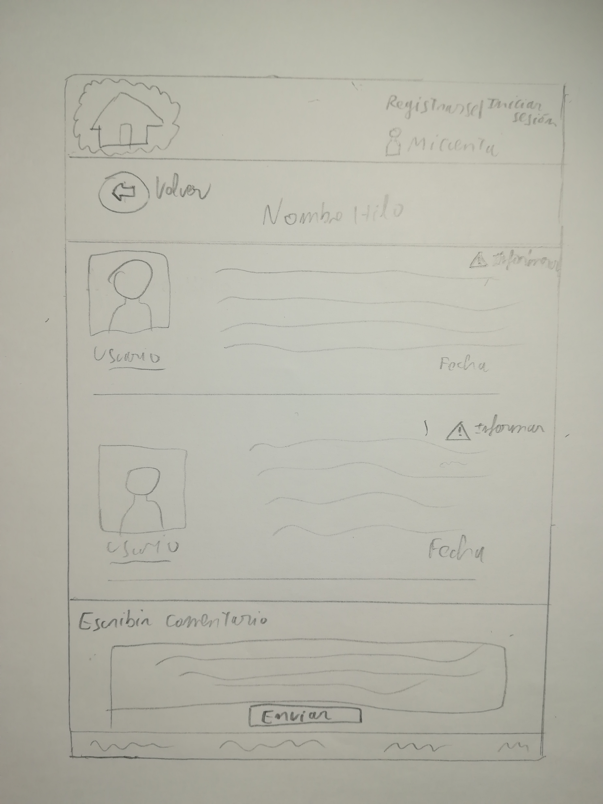

DIU - Practica2, entregables

## Paso 2. UX Design  

 2.a Feedback Capture Grid
----
 Interesante  •	Los usuarios que buscan alojamiento tienen la opción de recibir una notificación si alguien publica una habitación que se ajuste a las características que han especificado.  •	Servicio Premium que permite aumentar el número de habitaciones que se pueden ofrecer o destacar los anuncios. •	Gran cantidad de filtros para aplicar en una búsqueda (fumadores, m2, edad, etc). | Críticas  •	Debe pedir al usuario más información personal en el registro (fecha de nacimiento, teléfono, fotografía, validar e-mail, etc).  •	Un sistema de búsqueda tan restrictivo no es cómo para un usuario del sitio web.  •	Ofrece una cantidad excesiva de información en la página principal.
| ------------- | -------
  Preguntas  •	Hacer que los tiempos de estancia mínimos sean más flexible, de forma que permita, por ejemplo, que una persona busque alojamiento para un viaje.  •	Cuando se inicia sesión es preferible ver la pantalla de “Mi cuenta”.  •	Tener algún mecanismo que me permita retroceder en la página al menú anterior. Por ejemplo, si estoy creando una alerta, que me permita volver a “Mis alertas”. | Nuevas ideas  •	Foro que aloja comentarios y valoraciones sobre los alojamientos y usuarios.  •	Reducir el tamaño de las páginas de búsqueda y otros formularios (como el de modificar información del usuario) para que no sea una página excesivamente larga en la que es incómodo navegar.  •	Debe ser necesario pedir más información al usuario cuando este se registra (DNI, verificar e-mail, foto de perfil, etc), de forma que disminuya el uso de perfiles falsos.

  
  
  
>>>La propuesta de valor que se es un sistema similar al presentado en la práctica anterior Habitoom, pero modificando algunos aspectos:

>>>>•	Se ofrece una mayor flexibilidad a los usuarios en cuanto al periodo de estancia. Tiene como objetivo atraer usuarios potenciales que buscan un alojamiento para un corto periodo de tiempo, ya sea porque no quieren gastar mucho dinero en un viaje o algún otro motivo.

>>>>•	Se mejora el sistema de puntuación y comentarios. Uno de los aspectos de Habitoom que más llama la atención es que trata de ser una “red social” para compartir alojamiento. El gran problema es que está destinado a personas que busquen alojamiento para trabajar, estudiar, etc. Esto causa que el número de usuarios que usen el sitio web no sea demasiado elevado, y, además, no harán un uso excesivo de esta “red social”. Tratando de expandir el sitio web a otros usuarios, como personas que buscan alojamiento para un viaje, incrementa el número de usuarios potenciales, y permite crear un foro donde las personas valoren y comenten tanto los alojamientos como la experiencia con otros usuarios. Las distintas secciones de los foros pueden estar clasificadas por ejemplo por Comunidades autónomas. Esto es muy útil tanto para personas que quieren ofrecer alojamiento de forma habitual como para personas que van a hacer un uso elevado del sitio web para buscar alojamiento.

>>>>•	Es muy importante para un usuario saber con qué persona habla, más aún cuando puede que comparta alojamiento con ella. Se debe pedir información relevante sobre un usuario cuando este se registra. 
Además, el servicio Premium debe servir para ampliar funcionalidades, como aumentar el número de anuncios que se pueden publicar, por tanto, la información personal adicional que se mostraba con este servicio debe mostrarse sin ser usuario Premium.

 2.b Tasks & Sitemap 
-----
>>> Matriz de tareas:

>>> Se ha seleccionado la matriz de tareas debido a que permite expresar la funcionalidad para la que se diseña la aplicación web y su principal característica de un sistema. Como se puede observar en la matriz las principales diferencias entre usuarios registrados y no registrados es el uso del sistema de comentarios y valoraciones. Por lo general si un usuario no está registrado indica que no usa la página lo suficiente (o la está probando) como para hacerlo.

>>> Sitemap

 2.c Labelling 
----

>>> Identificar términos para diálogo con usuario  

Término | Significado     
| ------------- | -------
  Registrarse  | Crear una nueva cuenta en la plataforma
  Iniciar sesión  | Acceder a la plataforma utilizando una cuenta
  Cerrar sesión  | Dejar de utilizar la cuenta actual en la plataforma
  Buscar habitación  | Realizar una búsqueda de una habitación en función de unos filtros
  Seleccionar habitación  | Permite seleccionar un anuncio para ver la información de este
  Mis anuncios  | Listado de anuncios sobre alojamientos que un usuario tiene
  Publicar anuncios  | Crear un nuevo anuncio
  Asistencia  | Acceder a un sistema de asistencia para ponerse en contacto con una persona que pueda resolver el problema que tiene el usuario
  Sobre nosotros  | Información acerca de la aplicación web
  Mi cuenta  | Información de la cuenta de usuario
  Perfil  | Información personal del usuario. Permite modificar la información
  Mensajes  | Mensajes provenientes de otros usuarios y enviados
  Nuevo mensaje  | Crea y envía un mensaje a otro usuario
  Alertas  | Sistema que permite notificar a un usuario sobre nuevos anuncios que publican otros usuarios cuyas características son similares a las que se especifican cuando se crea la alerta
  Crear alerta  | Permite crear una nueva alerta seleccionando una serie de características
  Premium  | Servicio premium que ofrece la plataforma. En esta página se pueden configurar los aspectos del servicio o acceder a este si no se posee.
  Pago online  | Para el pago del servicio premium
  Configuración  | Permite modificar aspectos relacionados con la privacidad, notificaciones, etc
  Foro  | Sistema de foros que permite la interacción social entre los usuarios de la plataforma. 
  Crear hilo  | Permite crear un nuevo hilo dentro del sistema de foros
  Valorar usuario  | Puntuar y hacer un comentario sobre algún usuario con el que se ha convivido
  Valorar alojamiento  | Puntuar y hacer un comentario sobre algún alojamiento en el que se ha estado
  Seleccionar hilo  | Selecciona uno de lo hilos para acceder a este
  Enviar comentario  | Envía un comentario al hilo
  Buscar hilo  | Permite realizar una búsqueda entre todos los hilos en base a una frase introducida
  

 2.d Wireframes
-----

>>> Los bocetos que se han creado se corresponden con la página principal, la página del foro y la vista de un hilo:

>>> •	Página principal: La cabecera posee el logotipo de la aplicación y los enlaces básicos para registrarse/iniciar sesión/cerrar sesión y redirigir a la página con la información de la cuenta. Posee un especio reservado para mostrar imágenes de ejemplo, de forma que la página principal sea ilustrativa para un usuario que entra por primera vez. Por último posee enlaces a las funcionalidades de la aplicación web.

>>> •	Página del foro de la aplicación. Conserva la cabecera (que permite volver a la página inicial ) y el pie de página. Posee un menú para diversas funcionalidades y un motor de búsqueda, de forma que un usuario puede buscar hilos en función de una palabra o frase, y desde está página se permite crear un nuevo hilo.
Por último, se incluye un sistema de valoración de usuarios y alojamientos cuya finalidad es obtener información que pueda ser útil para el resto de usuarios. Se incluye en la sección de foro debido a la finalidad social que tiene (comentarios, opiniones, relación con otros usuarios, etc).

>>> •	Finalmente se incluye el boceto del aspecto de un hilo concreto del foro. De igual forma se incluye la cabecera y el pie de página. Incluye un botón para volver a la página de Foro. Es posible informar sobre los usuarios y escribir comentarios si el usuario está registrado.

