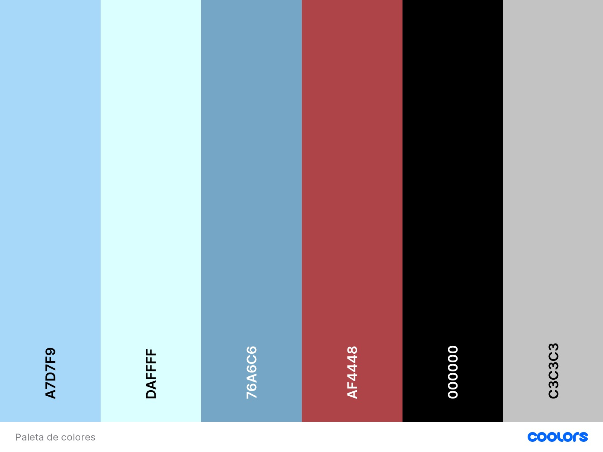

# DIU - Practica 3, entregables

## Análisis de MuseMap   

> Ante un mural, una escultura u otro tipo de arte público, a menudo surge la pregunta de ¿quién es el artista? Esta pregunta es la causa de que un equipo de desarrolladores decidiera crear MuseMap.
MuseMap busca cumplir los objetivos de un cliente ficticio elegido por los desarrolladores, la ciudad de Londres. Estos objetivos buscan apoyar el arte público de cara a visitantes y residentes.

>Para el desarrollo de la app han seguido los siguientes pasos:

>>Estudio de los usuarios:
>>>Realizaron una lluvia de ideas con el objetivo de identificar los usuarios potenciales y sus objetivos. 

>>Estudio del contexto:
>>>Debido al tipo de aplicación que se quiere desarrollar (aplicación con la cual un usuario puede interactuar con obras de arte públicas, como por ejemplo obteniendo información sobre el autor, uso de redes sociales, etc), el equipo decidió observar la interacción de las personas con el arte público.

>>Análisis de competencia:
>>>Realizan un estudio de aplicaciones que tienen una funcionalidad similar. Este estudio tiene como objetivo ver las funcionalidades que todas las aplicaciones tienen en común, por tanto es interesante implementarlas, y, nuevas funcionalidades que el resto de aplicaciones de la competencia no poseen.
>>>Los desarrolladores de MuseMap, gracias al análisis de competencia, identificaron los siguientes puntos en común:
>>>•	Mapa interactivo con puntos populares.
>>>•	Funciones para compartir en redes sociales.
>>>•	Uso de bases de datos con información de la obra o del autor de esta.
>>>Por último, observaron que ninguna de las aplicaciones de la competencia utilizaba un sistema para recomendaciones personales.
>>>El análisis de competencia es muy útil para identificar las funcionalidades comunes, y que por tanto es conveniente tenerlas en cuenta, y funcionalidades nuevas que otras aplicaciones no poseen. El principal inconveniente es detectar los puntos débiles que se deberían mejorar, cosa que si se hacía en la revisión de usabilidad.

>>Mapa de empatía:
>>>Desarrollo de un mapa de empatía que ayude a preparar el siguiente punto, las entrevistas a usuarios.

>>Entrevistas a usuarios:
>>>Gracias al mapa de empatía realizaron una encuesta para seleccionar las personas adecuadas y realizarles una entrevista.

>>Mapa de afinidad:
>>>Tras las entrevistas a los usuarios se realiza un mapa de afinidad con el que contrastaron sus ideas iniciales y las actuales obtenidas del mapa de afinidad.

>>Creación de personas ficticias:
>>>Los desarrolladores decidieron crear dos personas ficticias para identificar las metas y los puntos críticos de cara al usuario. Se centran en que un usuario puede pasar por una calle con algún tipo de arte público de forma voluntaria (Jan)  o involuntaria (Tom), por lo que crean dos personas siguiendo estos perfiles. Esto último muestra el potencial de las personas ficticias cuando el caso es simple (ir a un sitio de forma voluntaria o involuntaria).
A partir de las personas ficticias identifican las metas de estas y los puntos críticos o situaciones a evitar.

>>User Journey y mapa de experiencia:
>>>Deciden centrarse en la persona que pasa por una calle que posee algún tipo de arte de forma involuntaria, Tom. Este punto es interesante debido a que el comportamiento de estas personas es más variable, pueden interesarse por la obra, sentirse ofendidos, etc. Por otro lado, si una persona va voluntariamente es porque ya está interesada; su comportamiento es más predecible.
>>>Deciden realizar un “User Journey” para representar una situación en la que esta persona, casualmente, encuentra un tipo de arte que le parece interesante.
>>>Profundiza aún más realizando un mapa de experiencia, a partir del User Journey, para medir el estado emocional de la persona ficticia.

>>Escenarios de usuario:
>>>Se crean algunos escenarios en los cuales un usuario posee un problema el cual se podría soluciones utilizando una aplicación, lo que mejoraría su experiencia.

>>Planteamiento del problema:
>>>Gracias a los escenarios de usuario los desarrolladores son capaces de plantear el problema al que quieren dar solución por medio del desarrollo de la aplicación. Tratan de ver cómo podrían lograr los distintos objetivos (Que el arte público llegue a la gente, incrementar las oportunidades de las personas de hacer fotos de algo inusual, …). Por último, realizan una hipótesis para la solución del problema.

>>Flujo de usuario:
>>>Tras el planteamiento del problema comienzan con el proceso de diseño. Comienzan con la definición de un flujo de usuario para Tom en el que utiliza la aplicación para encontrar una obra de arte interesante cerca suya. El flujo de usuario finaliza cuando Tom comparte una foto de la obra en redes sociales.
>>>El flujo de usuario posee un alto nivel de detalle en las acciones del usuario que utiliza la aplicación. Esto permite enfocar mejor la aplicación de cara a las acciones del usuario. El principal problema es que con un único flujo de usuario no se pueden ver todas las funcionalidades que puede tener la aplicación.

>>Estudio del diseño:
>>>Se diseñan bocetos de muy bajo nivel de detalle de las características principales de la aplicación y su página principal.
Considero que no tiene mucho sentido realizar el estudio del diseño antes que la priorización de características, debido este se relaciona directamente con la realización de bocetos de un nivel de detalle mayor.

>>Priorización de características:
>>>Utilizan una matriz de 2x2 en la cual clasifican diferentes características en función de lo necesarias que sean y del esfuerzo para implementarlas.
>>>Este punto es interesante, ya que puede ser de gran ayuda para estimar el tiempo que se va a necesitar para desarrollar la aplicación y permite buscar un equilibrio entre tiempo requerido y funcionalidades que va a tener la aplicación.

>>Primera iteración de prototipos en papel:
>>>Realizan unos nuevos bocetos en papel, de un nivel de detalle mayor a los anteriores. Realizan una prueba de usabilidad que les genera dudas sobre si la idea de la aplicación es la correcta.

>>Segunda iteración de prototipos en papel:
>>>Cambian completamente la idea principal de la aplicación, por lo que diseñan nuevos bocetos que representan esa idea.

>>Diseños Hi-Fi:
>>>Crean unos diseños con un alto nivel de detalle y, de nuevo, realizan una prueba de usabilidad utilizando estos últimos diseños. Con esta segunda prueba consiguen información de algunos problemas con el diseño actual.
>>>Es muy interesante la realización de bocetos en iteraciones. De esta forma, tras diseñar unos bocetos y realizar una prueba de usabilidad junto con estos, se facilita la tarea de detectar problemas de diseño en la aplicación.

>>Mapa del sitio:
>>>En este punto, una vez los desarrolladores tienen los diseños finales de las páginas principales de la aplicación, crean un mapa del sitio.
>>>En las prácticas de la asignatura el mapa del sitio se desarrolla antes que los bocetos de la aplicación. Esta forma alternativa me parece más adecuada, siempre que se tenga claro los que se quiere desarrollar, debido a que, a medida que se realiza el diseño de los bocetos la estructura del sitio puede variar, lo que conlleva a modificaciones en el mapa del sitio.

>>Guía de estilo:
>>>Definen la fuente de la letra y los colores que se van a utilizar en la interfaz de usuario.
>>>La justificación me parece pobre. Considero que, más allá de buscar colores de moda, la principal prioridad es utilizar una gama de colores que no dificulten el uso de la aplicación.
>>>Por ejemplo, el uso de letra blanca sobre azul claro no es adecuado, ya que dificulta la lectura en la aplicación.

>>Mock-Ups finales:
>>>Mock-Ups finales para MuseMap. Los diseños no están mal, pero aspectos como el comentado en el punto anterior (letra blanca en fondo azul claro) bajan su calidad.
>>>Otro punto a destacar es el abuso del color negro. El color negro, por lo general no destaca o pasa desapercibido, por lo que no es adecuado para marcar las obras de arte en un mapa. Además, lo utiliza en menús y botones, que, aunque estéticamente está bien, quizás no es adecuado para una aplicación.

>>Conclusión:
>>>Me ha parecido muy interesante el proceso que ha seguido este equipo de desarrolladores para el desarrollo de MuseMap. Bajo mi punto de vista el método más relevante ha sido el método iterativo en el diseño de bocetos, en el cual sometían a los bocetos a una prueba de usabilidad. De esta forma el equipo puede acercarse a la aplicación ideal que desean desarrollar.
>>>Podría haber sido interesante el uso de una revisión de usabilidad de algunas aplicaciones populares, para que, de forma similar al análisis de competencia, con el que obtenían las funcionalidades comunes, pudiesen detectar puntos que mejorar del resto de aplicaciones.

## Propuesta de elementos de diseño o patrones a usar 

>>Tipografía:
>>>•	Para los encabezados la aplicación utilizará la fuente Noto Serif, una fuente que busca atraer y llamar la atención del usuario. 
>>>•	Para el cuerpo utilizará la fuente Roboto, una fuente fácil de leer con tamaños de letra pequeños.

>>Paleta de colores:

>>>He escogido colores azules para los fondos de la aplicación, de forma que las diferentes zonas de la aplicación pueden ser delimitadas sin causar un gran contraste con el resto. Tanto el texto como algunos iconos están en color negro, mientras que hay otros iconos, de color rojizo, que indica que su uso no es habitual.

>>Iconos más relevantes de la aplicación:

>>> Mi cuenta: 
>>> Foro: 
>>> Buscar habitación: 
>>> Asistencia: 
>>> Sobre nosotros: 
>>> Mis anuncios: 
>>> Publicar habitación: 
>>> Mis mensajes: 

>>En el siguiente boceto podemos ver una posible distribución de los iconos utilizando esta paleta de colores y la tipografía indicada:

>>Principios de diseño:
>>>Algunos de los principios de diseño que se aplican, siguiendo la guía de principios de diseño de las aplicaciones para dispositivos móviles de Google, son los siguientes:
>>>•	Navegación
>>>>>>-	Funcionalidades principales en una posición privilegiada en la página principal
>>>>>>-	Permitir al usuario volver un paso atrás. Por ejemplo, cuando se encuentran en la página de una habitación concreta y desean volver al listado de las habitaciones de una búsqueda.
>>>•	Búsquedas
>>>>>>-	Uso de un campo de búsqueda de habitación en la página principal y de un campo de búsqueda para hilos en los foros de la aplicación.
>>>>>>-	Uso de opciones para filtrar y ordenar resultados en una búsqueda de habitación (precio, amaño, …).
>>>•	Comercio
>>>>>>-	Recordar la información sobre las búsquedas anteriores
>>>>>>-	Filtrado de las opiniones de los usuarios para una habitación u otro usuario.
>>>•	Registro
>>>>>>-	No es necesario el registro para realizar una búsqueda de una habitación. El registro será necesario para enviar un mensaje a otro usuario, realizar una valoración, crear un nuevo hilo en la sección de foros …
>>>>>>-	Se marcan las diferencias entre la opción de Registrarse y la de Iniciar sesión.
>>>•	Formularios
>>>>>>-	Informe de los errores de un formulario en tiempo real, como, por ejemplo, enviar un formulario con un campo en blanco obligatorio.
>>>•	Usabilidad y facilidad de comprensión
>>>>>>-	Uso e un vocabulario adecuado para los usuarios de la aplicación.
>>>>>>-	Uso de etiquetas de texto en elementos visuales e iconos.

## Historia en Video del UX Case Study

## Documentación. Valoración del equipo sobre la realización de esta práctica o los problemas surgidos
