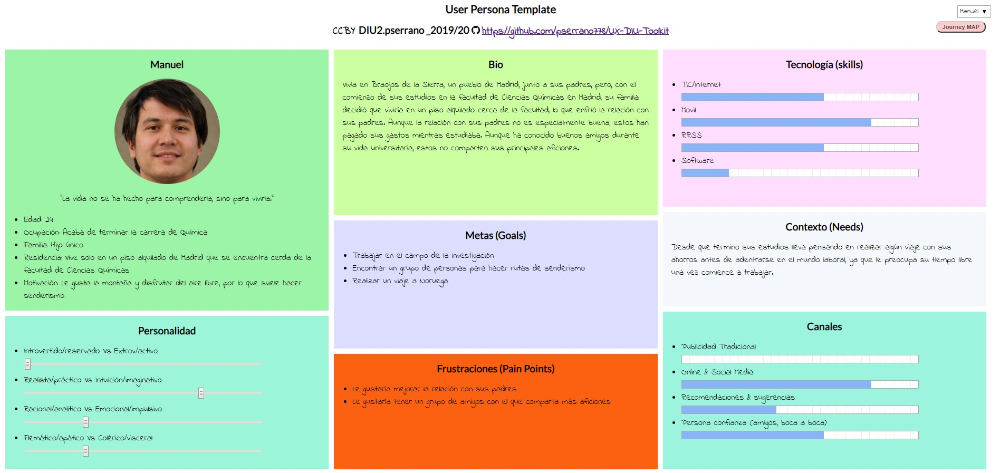
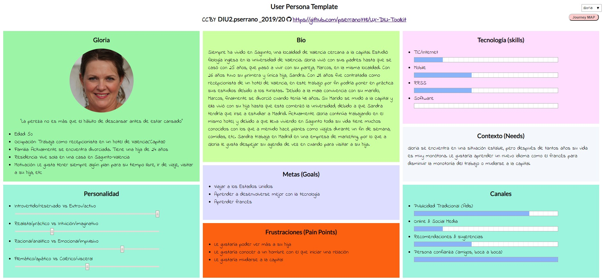
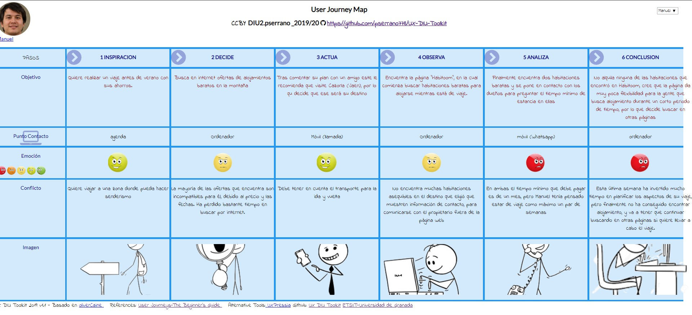
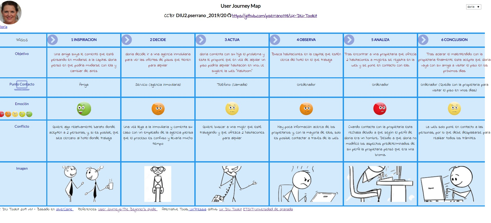
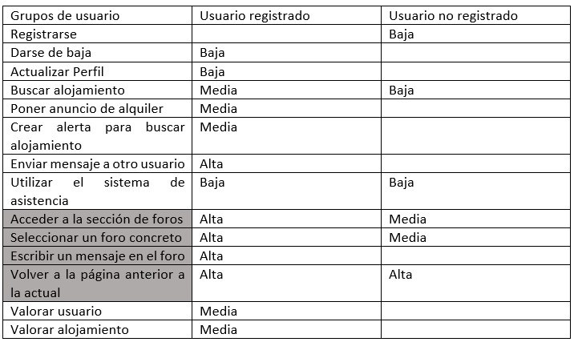
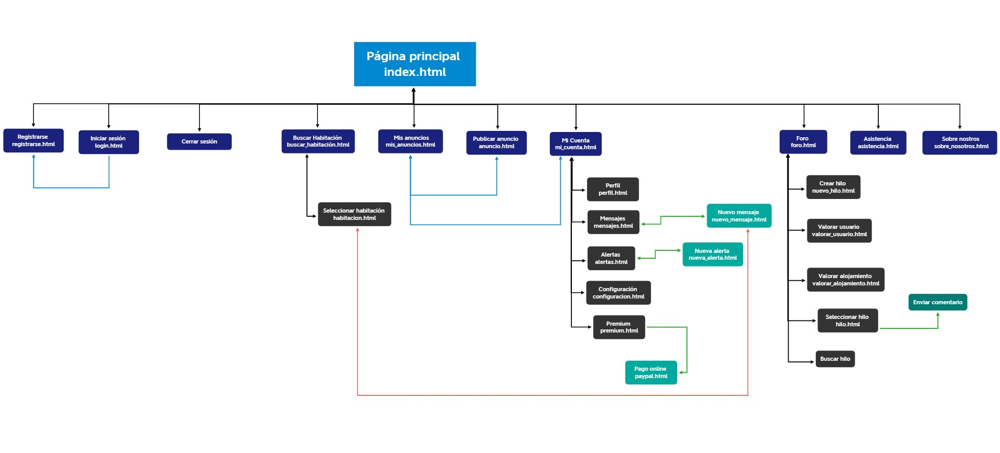

# DIU20
Prácticas Diseño Interfaces de Usuario 2019-20 (Economía Colaborativa) 

Grupo: DIU2.pserrano.  Curso: 2019/20 

Proyecto: 

Descripción: 

Logotipo: 

Miembros
 * :bust_in_silhouette:   Pedro Serrano Pérez     :octocat:     

----- 

En esta práctica estudiaremos un caso de plataforma de economía colaborativa y realizaremos una propuesta para su diseño Web/movil. Utilizaremos herramientas y entregables descritos en el siguiente CheckList (https://github.com/mgea/UX-DIU-Checklist) 

Qué es economia colaborativa: Martínez-Polo, J. (2019). **El fenómeno del consumo colaborativo: del intercambio de bienes y servicios a la economía de las plataformas**, *Sphera Publica, 1*(19), 24-46. http://sphera.ucam.edu/index.php/sphera-01/article/view/363/14141434

>>> Este documento es el esqueleto del report final de la práctica. Aparte de subir cada entrega a PRADO, se debe actualizar y dar formato de informe final a este documento online. 

# Proceso de Diseño 

## Paso 1. UX Desk Research & Analisis 

 1.a Competitive Analysis
-----

>>> Badi:

>>>> Permite publicar una habitación para buscar un inquilino y realizar una búsqueda para reservar y alquilar una habitación.
Posee un sistema de búsqueda que utiliza GoogleMaps para poder buscar una habitación en una ciudad concreta. Este sistema posee una herramienta para buscar alojamiento cerca de donde se encuentra el usuario actualmente usando la ubicación. No es necesario estar registrado para realizar una búsqueda.

>>> Couchsurfing:

>>>>Su principal objetivo es compartir una casa con viajeros y compartir experiencias en la ciudad del huésped, de forma que este actúa como guía para el viajero.
Cada usuario debe rellenar información sobre su estilo de vida y objetivos en su perfil. De esta forma es más fácil encontrar personas afines. 

>>> Compartetupiso:

>>>> Permite ofrecer y buscar alojamiento en función de la "experiencia" que el usuario quiere experimentar, es decir, en función de si desea compartir aficiones con alguien, trabajar en un campo relacionado (afinidad profesional), etc.
Los usuarios son verificados de forma manual y se comprueba que una persona puede realmente ofrecer un espacio. Los usuarios que ofrecen alojamiento pueden optar por cobrar o no un alquiler.
Cuando tratas de iniciar sesión, siempre aparece la misma pantalla con el mensaje “Gracias, ya tenemos tus datos, en breve te contactaremos.”

>>> Habitoom:

>>>> Es un sitio web cuyo objetivo es conectar personas que buscan un lugar para vivir con aquellas que ofrecen un sitio para alquilar.
Este sitio web trata de crear una comunidad para que todos aporten sus experiencias vividas de forma que sirvan como referencia a futuros inquilinos.
Permite realizar búsquedas de alquileres sin necesidad de registrarse, aplicando filtros en la búsqueda como metros cuadrados, número de inquilinos, edad de los inquilinos, etc.
Habitoom permite que el usuario no solo publique un espacio para alquilar o buscar uno, también permite crear alertas con ciertos filtros para que avisen al usuario cuando alguien ha publicado un alquiler que se adapte.
En el registro no se pide información como el sexo o la fecha de nacimiento del usuario, por lo que estos son asignados a un valor predefinido, por lo que el usuario ha de cambiarlos posteriormente. 
He escogido este sitio web debido a que posee un servicio premium que permite publicación ilimitada de espacios de alquiler, publicar todos los datos de contacto, etc.

 1.b Persona
-----

>>> Manuel

>>>> He escogido a Manuel debido a que acaba de finalizar sus estudios y quiere tomarse un tiempo libre antes de comenzar a trabajar. Hasta ahora sus padres pagaban los costes de sus estudios, alojamiento, etc, por ello se encuentra en una etapa crítica en la que debe volverse totalmente independiente en el aspecto económico y, por tanto, no tiene mucho tiempo hasta que tenga que adentrarse de lleno en el mundo laboral.

>>>Ficha Manuel:

>>> Gloria

>>>> Gloria, la otra persona que he elegido, se trata de una mujer divorciada de edad avanzada que lleva viviendo durante toda su vida en el mismo sitio y lleva trabajando durante muchos años como recepcionista en un hotel. Aunque tiene estabilidad tanto económicamente como en el ámbito personal su vida es muy monótona ya que lleva mucho tiempo viviendo en el mismo lugar y trabajando en el hotel.

>>>Ficha Gloria:

 1.c User Journey Map
----

>>> La experiencia de Manuel es bastante común. Una persona joven quiere ir de viaje, pero no tiene mucho dinero, por lo que busca compartir un piso/alquilar una habitación para no tener que gastar mucho en alojamiento. El problema es que debido a las prisas no utiliza la web adecuada para esta búsqueda, por lo que no queda nada satisfecho.

>>>Experiencia Manuel:

>>> La experiencia de Gloria es menos habitual, teniendo en cuenta que se trata de una persona con 50 años. Lleva toda su vida viviendo en el mismo pueblo, pero decide mudarse a la capital, donde trabaja, con una amiga. En este caso si utiliza una web adecuada, el problema viene cuando se encuentra con las carencias de la web, que para una persona no acostumbrada a navegar por internet o al uso de ordenadores pueden hacerle pasar un mal rato.

>>>Experiencia Gloria:

 1.d Usability Review
----
>>> Usability Review: [Usability-review-DIU2-pserrano](P1/Usability-review-DIU2-pserrano.pdf)

>>> Valoración numérica: 67.

>>> El sitio web “Habitoom” tiene como finalidad poner en contacto a personas con el fin de alquilar una habitación. Trata de ser una especie de “red social” para alquiler de habitaciones.
Una de las principales desventajas es el periodo de estancia mínimo de 1 mes, que se debe a que está destinada a personas que se mudan por cuestiones de trabajo, estudios, etc. Esto hace que sea poco flexible e inviable para personas que buscan alojamiento para vacaciones o similares.

>>> En cuanto a la funcionalidad Habitoom cumple su objetivo. Proporciona las herramientas necesarias para poner un anuncio de una habitación o buscar una. A pesar de cumplir su objetivo posee carencias como la poca flexibilidad de su sistema de búsqueda, que solo permite buscar con el formato “Provincia, País”, lo cual es bastante incómodo para cualquier usuario. Otra de sus grandes desventajas es la poca información que se requiere para crearse una cuenta (e-mail, nombre y contraseña), el resto de campos de información o están predeterminados (sexo o fecha de nacimiento) o no es necesario completarlos (foto de perfil, descripción, etc), lo que hace que un usuario poco no modifique estos parámetros de su perfil.

>>> Por último, posee un servicio premium que permite publicar un número ilimitado de habitaciones y publicar el número de teléfono personal. Este aspecto es bastante negativo, ya que la mayoría de usuario no pagan dicho servicio, pero el número de teléfono es la mejor forma para comunicar a usuario normales (uso a aplicaciones de mensajería como “Whatsapp”) en casos como alquiler de piso o habitación. Esto provoca que el número de usuarios potenciales decrezca debido a las pobres formas que tiene el sitio web de poner en contacto a los usuarios.

>>> La conclusión es que, aunque ofrece las funcionalidades básicas para cumplir su objetivo, su filosofía de red social hace que sea una web inferior a muchas otras similares (en el ámbito de alquilar piso, compartir piso, etc).

## Paso 2. UX Design  

 2.a Feedback Capture Grid
----
 Interesante  •	Los usuarios que buscan alojamiento tienen la opción de recibir una notificación si alguien publica una habitación que se ajuste a las características que han especificado.  •	Servicio Premium que permite aumentar el número de habitaciones que se pueden ofrecer o destacar los anuncios. •	Gran cantidad de filtros para aplicar en una búsqueda (fumadores, m2, edad, etc). | Críticas  •	Debe pedir al usuario más información personal en el registro (fecha de nacimiento, teléfono, fotografía, validar e-mail, etc).  •	Un sistema de búsqueda tan restrictivo no es cómo para un usuario del sitio web.  •	Ofrece una cantidad excesiva de información en la página principal.
| ------------- | -------
  Preguntas  •	Hacer que los tiempos de estancia mínimos sean más flexible, de forma que permita, por ejemplo, que una persona busque alojamiento para un viaje.  •	Cuando se inicia sesión es preferible ver la pantalla de “Mi cuenta”.  •	Tener algún mecanismo que me permita retroceder en la página al menú anterior. Por ejemplo, si estoy creando una alerta, que me permita volver a “Mis alertas”. | Nuevas ideas  •	Foro que aloja comentarios y valoraciones sobre los alojamientos y usuarios.  •	Reducir el tamaño de las páginas de búsqueda y otros formularios (como el de modificar información del usuario) para que no sea una página excesivamente larga en la que es incómodo navegar.  •	Debe ser necesario pedir más información al usuario cuando este se registra (DNI, verificar e-mail, foto de perfil, etc), de forma que disminuya el uso de perfiles falsos.

  
  
  
>>>La propuesta de valor que se es un sistema similar al presentado en la práctica anterior Habitoom, pero modificando algunos aspectos:

>>>>•	Se ofrece una mayor flexibilidad a los usuarios en cuanto al periodo de estancia. Tiene como objetivo atraer usuarios potenciales que buscan un alojamiento para un corto periodo de tiempo, ya sea porque no quieren gastar mucho dinero en un viaje o algún otro motivo.

>>>>•	Se mejora el sistema de puntuación y comentarios. Uno de los aspectos de Habitoom que más llama la atención es que trata de ser una “red social” para compartir alojamiento. El gran problema es que está destinado a personas que busquen alojamiento para trabajar, estudiar, etc. Esto causa que el número de usuarios que usen el sitio web no sea demasiado elevado, y, además, no harán un uso excesivo de esta “red social”. Tratando de expandir el sitio web a otros usuarios, como personas que buscan alojamiento para un viaje, incrementa el número de usuarios potenciales, y permite crear un foro donde las personas valoren y comenten tanto los alojamientos como la experiencia con otros usuarios. Las distintas secciones de los foros pueden estar clasificadas por ejemplo por Comunidades autónomas. Esto es muy útil tanto para personas que quieren ofrecer alojamiento de forma habitual como para personas que van a hacer un uso elevado del sitio web para buscar alojamiento.

>>>>•	Es muy importante para un usuario saber con qué persona habla, más aún cuando puede que comparta alojamiento con ella. Se debe pedir información relevante sobre un usuario cuando este se registra. 
Además, el servicio Premium debe servir para ampliar funcionalidades, como aumentar el número de anuncios que se pueden publicar, por tanto, la información personal adicional que se mostraba con este servicio debe mostrarse sin ser usuario Premium.

 2.b Tasks & Sitemap 
-----
>>> Matriz de tareas:

>>> Se ha seleccionado la matriz de tareas debido a que permite expresar la funcionalidad para la que se diseña la aplicación web y su principal característica de un sistema. Como se puede observar en la matriz las principales diferencias entre usuarios registrados y no registrados es el uso del sistema de comentarios y valoraciones. Por lo general si un usuario no está registrado indica que no usa la página lo suficiente (o la está probando) como para hacerlo.

>>> Sitemap

 2.c Labelling 
----

>>> Identificar términos para diálogo con usuario  

Término | Significado     
| ------------- | -------
  Registrarse  | Crear una nueva cuenta en la plataforma
  Iniciar sesión  | Acceder a la plataforma utilizando una cuenta
  Cerrar sesión  | Dejar de utilizar la cuenta actual en la plataforma
  Buscar habitación  | Realizar una búsqueda de una habitación en función de unos filtros
  Seleccionar habitación  | Permite seleccionar un anuncio para ver la información de este
  Mis anuncios  | Listado de anuncios sobre alojamientos que un usuario tiene
  Publicar anuncios  | Crear un nuevo anuncio
  Asistencia  | Acceder a un sistema de asistencia para ponerse en contacto con una persona que pueda resolver el problema que tiene el usuario
  Sobre nosotros  | Información acerca de la aplicación web
  Mi cuenta  | Información de la cuenta de usuario
  Perfil  | Información personal del usuario. Permite modificar la información
  Mensajes  | Mensajes provenientes de otros usuarios y enviados
  Nuevo mensaje  | Crea y envía un mensaje a otro usuario
  Alertas  | Sistema que permite notificar a un usuario sobre nuevos anuncios que publican otros usuarios cuyas características son similares a las que se especifican cuando se crea la alerta
  Crear alerta  | Permite crear una nueva alerta seleccionando una serie de características
  Premium  | Servicio premium que ofrece la plataforma. En esta página se pueden configurar los aspectos del servicio o acceder a este si no se posee.
  Pago online  | Para el pago del servicio premium
  Configuración  | Permite modificar aspectos relacionados con la privacidad, notificaciones, etc
  Foro  | Sistema de foros que permite la interacción social entre los usuarios de la plataforma. 
  Crear hilo  | Permite crear un nuevo hilo dentro del sistema de foros
  Valorar usuario  | Puntuar y hacer un comentario sobre algún usuario con el que se ha convivido
  Valorar alojamiento  | Puntuar y hacer un comentario sobre algún alojamiento en el que se ha estado
  Seleccionar hilo  | Selecciona uno de lo hilos para acceder a este
  Enviar comentario  | Envía un comentario al hilo
  Buscar hilo  | Permite realizar una búsqueda entre todos los hilos en base a una frase introducida
  

 2.d Wireframes
-----

>>> Plantear el  diseño del layout para Web/movil (organización y simulación ) 

## Paso 3. Make (Prototyping) 

 3.a Moodboard
-----

>>> Plantear Diseño visual con una guía de estilos visual (moodboard) 

  3.b Landing Page
----

>>> Plantear Landing Page 

 3.c Guidelines
----

>>> Estudio de Guidelines y Patrones IU a usar 

  3.d Mockup
----

>>> Layout: Mockup / prototipo HTML  (que permita simular tareas con estilo de IU seleccionado)

## Paso 4. UX Check (Usability Testing) 

 4.a A/B Testing
----

>>> Comprobacion de asignaciones para A/B Testing. Asignaciones https://github.com/mgea/DIU19/blob/master/ABtesting.md

>>>> Práctica A: 

 4.b User Testing
----

>>> Usuarios para evaluar prácticas 

| Usuarios | Sexo/Edad     | Ocupación   |  Exp.TIC    | Personalidad | Plataforma | TestA/B
| ------------- | -------- | ----------- | ----------- | -----------  | ---------- | ----
| User1's name  | H / 18   | Estudiante  | Media       | Introvertido | Web.       | A 
| User2's name  | H / 18   | Estudiante  | Media       | Timido       | Web        | A 
| User3's name  | M / 35   | Abogado     | Baja        | Emocional    | móvil      | B 
| User4's name  | H / 18   | Estudiante  | Media       | Racional     | Web        | B 

. 4.c Cuestionario SUS
----

>>> Usaremos el **Cuestionario SUS** para valorar la satisfacción de cada usuario con el diseño (A/B) realizado. Para ello usamos la [hoja de cálculo](https://github.com/mgea/DIU19/blob/master/Cuestionario%20SUS%20DIU.xlsx) para calcular resultados sigiendo las pautas para usar la escala SUS e interpretar los resultados
http://usabilitygeek.com/how-to-use-the-system-usability-scale-sus-to-evaluate-the-usability-of-your-website/)
Para más información, consultar aquí sobre la [metodología SUS](https://cui.unige.ch/isi/icle-wiki/_media/ipm:test-suschapt.pdf)

>>> Adjuntar captura de imagen con los resultados + Valoración personal 

 4.c Usability Report
----

>> Añadir report de usabilidad para práctica B 

## Paso 5. Evaluación de Accesibilidad  

  5.a Accesibility evaluation Report
----

>>> Indica qué pretendes evaluar (de accesibilidad) y qué resultados has obtenido + Valoración personal

>>> Evaluación de la Accesibilidad (con simuladores o verificación de WACG) 

## Conclusión / Valoración de las prácticas

>>> (90-150 caracteres) Opinión del proceso de desarrollo de diseño siguiendo metodología UX y valoración (positiva /negativa) de los resultados obtenidos  

